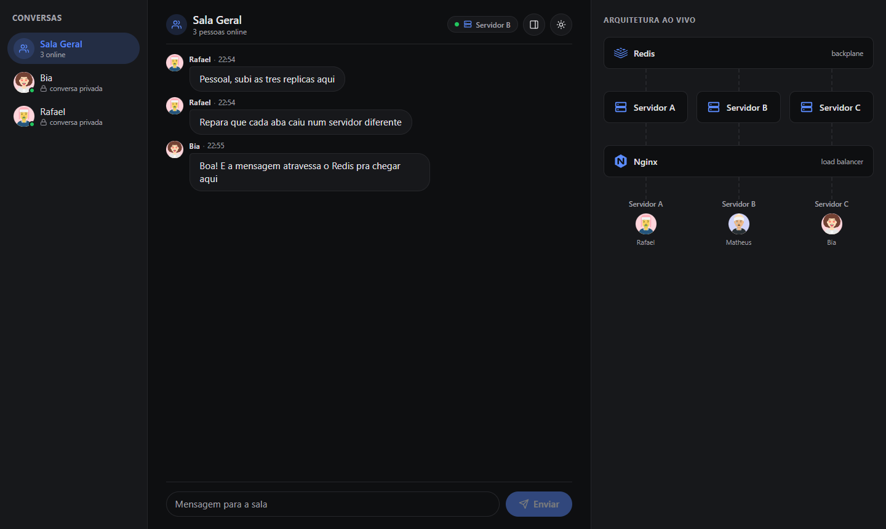
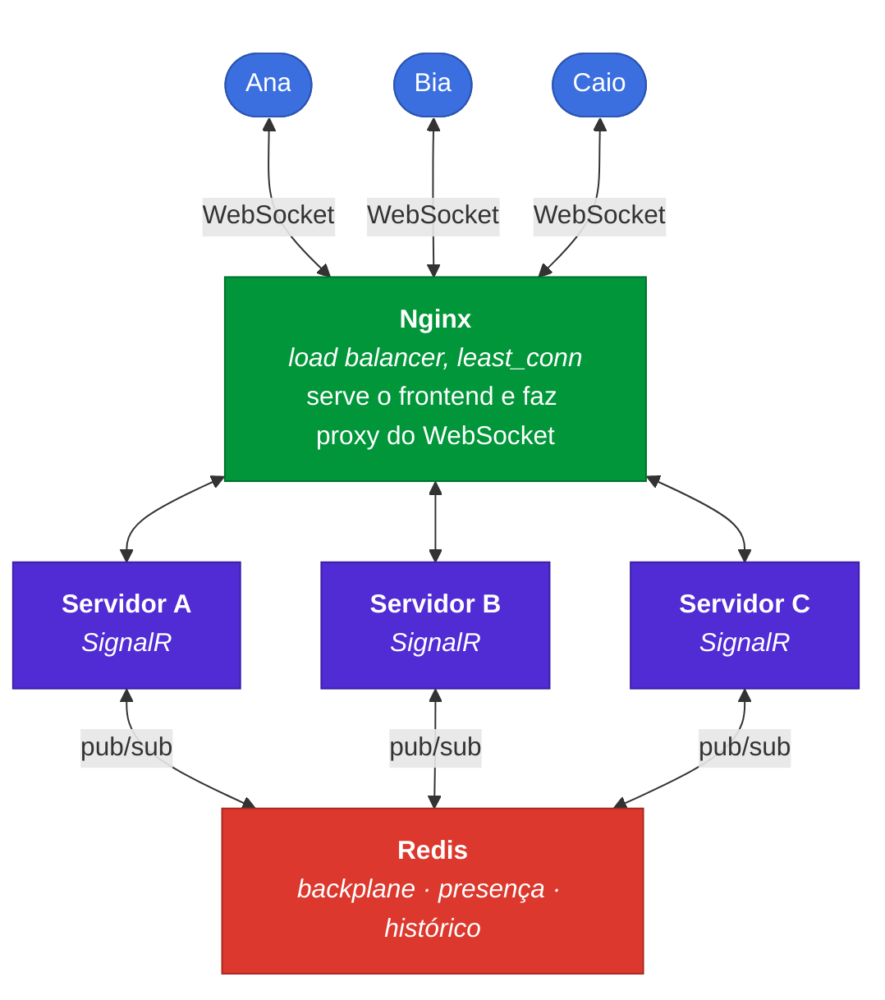
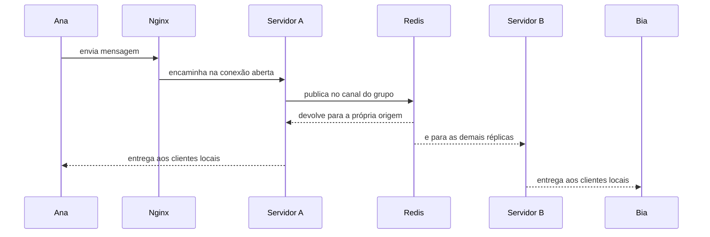
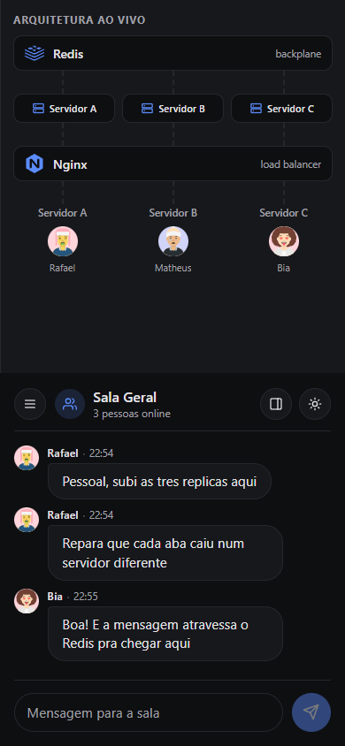

<div align="center">

# Web Chat

**Um chat em tempo real que mostra a própria arquitetura funcionando por dentro.**

Três réplicas de backend sincronizadas por Redis, atrás de um load balancer,
com um painel que anima cada mensagem percorrendo o caminho real entre elas.

[](https://dotnet.microsoft.com/)
[](https://angular.dev/)
[](https://learn.microsoft.com/aspnet/core/signalr/introduction)
[](https://redis.io/)
[](https://nginx.org/)
[](https://docs.docker.com/compose/)
[](#testes)

[**Ver funcionando**](https://web-chat-u5ko.onrender.com) · [Arquitetura](#arquitetura) · [Rodar localmente](#rodando-localmente) · [Decisões técnicas](#decisões-técnicas)

</div>



---

## O problema

Escalar uma aplicação com WebSocket é diferente de escalar uma API comum. Uma
requisição HTTP começa e termina; uma conexão WebSocket fica aberta por horas,
presa a um processo específico. No momento em que existe mais de uma réplica,
quatro problemas aparecem de uma vez:

|   | Problema | Como está resolvido aqui |
|---|---|---|
| **1** | Cada réplica só conhece as próprias conexões | Redis como backplane do SignalR |
| **2** | Round-robin desequilibra com conexão longa | `least_conn` no Nginx |
| **3** | "Quem está online" difere entre réplicas | Presença compartilhada no Redis, com contador atômico |
| **4** | Uma réplica cair não pode derrubar quem estava nela | Sinal de vida por réplica e identidade de aba |

Esses problemas são invisíveis quando tudo funciona, e é justamente aí que
mora a dificuldade de estudá-los. Por isso a aplicação tem um **visualizador de
arquitetura ao vivo**: um painel que desenha Redis, réplicas, Nginx e pessoas
conectadas, e anima cada mensagem percorrendo o caminho real, salto a salto.

## Arquitetura



O caminho de uma mensagem na Sala Geral, do jeito que o visualizador desenha:



> [!NOTE]
> A réplica de origem receber a própria mensagem de volta parece redundante,
> mas é o comportamento real: **não existe atalho de entrega local**. Isso foi
> confirmado lendo o código-fonte do `RedisHubLifetimeManager`, onde
> `SendGroupAsync` apenas publica. O visualizador reflete isso, e não uma
> simplificação didática.

## Rodando localmente

Único pré-requisito: Docker.

```bash
git clone https://github.com/mapompeo/web-chat.git
cd web-chat
docker compose up --build
```

Abra <http://localhost>. Sobem cinco containers: Redis, três réplicas do
backend e o Nginx, que também serve o frontend compilado.

Para abrir de outro aparelho na mesma rede, troque `localhost` pelo IP da
máquina.

## Vendo a escala funcionar

Abra o chat em **duas abas com nomes diferentes**. O selo no cabeçalho mostra em
qual servidor cada uma caiu, e o visualizador mostra as duas em réplicas
diferentes. Mande uma mensagem e acompanhe o pulso subindo até o Redis e
descendo para as outras réplicas.

Depois derrube a réplica onde você está:

```bash
docker compose kill backend1
```

A conexão cai, o selo pisca em âmbar, e em seguida você **reaparece em outro
servidor com as mensagens preservadas**. Em cerca de quinze segundos, a presença
que ficou órfã na réplica morta some do visualizador sozinha.

<details>
<summary><b>Inspecionando o Redis por dentro</b></summary>

```bash
# quem está online, e em qual réplica
docker compose exec redis redis-cli HKEYS "room:Geral:presence-count"
docker compose exec redis redis-cli HKEYS "room:Servidor A:presence-count"

# quais réplicas estão vivas agora
docker compose exec redis redis-cli KEYS "replica:*"

# o caminho de cada mensagem entre réplicas
docker compose logs -f
```

</details>

## Decisões técnicas

<details open>
<summary><b><code>least_conn</code> em vez de round-robin</b></summary>

Round-robin distribui bem requisições curtas, mas WebSocket fica aberto por
muito tempo: quem desconecta não libera vaga nenhuma no rodízio, e o
desequilíbrio só cresce. `least_conn` manda cada conexão nova para quem tem
menos conexões abertas agora.

Não é sticky session: a escolha é por contagem, não por identidade do cliente.
Prender cada pessoa a uma réplica esconderia justamente o que o projeto quer
mostrar.

</details>

<details>
<summary><b>Conexão sem negociação prévia</b></summary>

O cliente usa `skipNegotiation` com transporte WebSocket puro. Sem isso, o
SignalR faz um `POST /negotiate` separado antes do upgrade, e sem sticky session
o Nginx pode mandar as duas requisições para réplicas diferentes: a segunda
recusa a conexão, porque o `connectionId` só existe na memória de quem
negociou. Pulando a negociação, a conexão vira uma requisição atômica.

</details>

<details>
<summary><b>Presença como contador, não como lista</b></summary>

A presença é um hash `usuário -> número de conexões`, atualizado por scripts
Lua. Isso resolve dois casos de uma vez: várias abas da mesma pessoa, que só
some quando a última cai, e a corrida do F5 entre réplicas diferentes, em que a
conexão nova entra antes de a antiga sair.

Os scripts são Lua porque é a única forma de o Redis executar ler, decidir e
escrever como uma operação indivisível. Em comandos separados, duas conexões
simultâneas se intercalariam e corromperiam a contagem.

</details>

<details>
<summary><b>Failover exigiu duas peças, não uma</b></summary>

Quando um processo morre de repente, ele não roda `OnDisconnectedAsync`, e a
presença de quem estava nele fica registrada sem conexão por trás.

A primeira peça é um sinal de vida: cada réplica se anuncia a cada cinco
segundos, e as demais limpam a presença de quem parou de responder. **Só que
isso não bastou.** A réplica morta ainda conta como viva até o sinal vencer, e a
reconexão automática começa imediatamente, então a pessoa batia no registro que
ela própria tinha deixado e era recusada com "esse nome já está em uso".

A segunda peça é um identificador estável por aba, que muda a pergunta de "esse
nome existe?" para "esse nome pertence a outro?". Só com as duas o failover
funciona, e há um teste de ponta a ponta que derruba um container para provar.

</details>

<details>
<summary><b>Histórico deliberadamente curto</b></summary>

A Sala Geral guarda as últimas cinquenta mensagens numa lista Redis, só para
recarregar a página não cair numa tela vazia.

Conversa privada não é guardada: armazenar conteúdo endereçado a uma pessoa é
outra decisão, com outras implicações. O projeto trata mensagem privada como
anônima até no visualizador, que recebe apenas os nomes das réplicas envolvidas,
sem remetente nem conteúdo.

</details>

<details>
<summary><b>Sem biblioteca de componentes</b></summary>

Botão, campo de texto e ícones são escritos no próprio projeto, usando as mesmas
variáveis de tema do resto da interface. Os avatares são gerados no navegador a
partir do nome, sem chamada de rede, então a mesma pessoa tem sempre o mesmo
rosto.

O projeto usava PrimeNG, mas apenas para dois elementos, e a versão 22 passou a
exigir licença comercial, injetando um aviso fixo que no celular cobria o botão
de enviar. Sair dele reduziu o bundle de 907kB para 636kB.

</details>

## Testes

```bash
cd backend  && dotnet test    # 19 testes de unidade
cd frontend && npm run e2e    # 9 testes de ponta a ponta
```

Os testes de ponta a ponta rodam com Playwright **contra o stack de verdade** do
`docker compose`, e não contra um servidor de desenvolvimento. É de propósito: o
que vale verificar aqui não é se um componente renderiza, e sim se duas pessoas
em réplicas diferentes se enxergam, se o nome duplicado é recusado e se a
conversa sobrevive a recarregar a página. Nada disso existe sem a infraestrutura
em volta.

Um deles derruba uma réplica com `docker compose kill` no meio da execução e
verifica que a pessoa migra para outra sem perder a conversa. Usa `kill` e não
`stop` porque encerrar com educação esconde justamente o caso difícil: sem
`OnDisconnectedAsync`, fica presença órfã para trás.

## No celular



A lista de conversas vira gaveta e o visualizador ocupa a metade de cima da
tela, em vez de sumir. Em tela grande, os dois painéis laterais são
redimensionáveis, limitados a um terço da largura.

## Stack

| Camada | Tecnologia |
|---|---|
| Backend | ASP.NET Core 10, SignalR |
| Sincronização | Redis: backplane, presença e histórico |
| Frontend | Angular com Signals, sem biblioteca de componentes |
| Load balancer | Nginx com `least_conn` |
| Orquestração | Docker Compose, três réplicas nomeadas |
| Testes | xUnit e Moq, Playwright de ponta a ponta |

## Limitações conhecidas

Escolhas conscientes, não pendências esquecidas:

- **Sem autenticação.** "Nome de usuário" é só um texto digitado, sem senha.
- **Sem persistência real.** Tudo vive no Redis e some com ele.
- **Mensagem privada não tem entrega garantida.** Se a pessoa cair bem na hora
  do envio, a mensagem se perde: não há fila, nova tentativa, nem aviso de falha.
- **Topologia fixa em três réplicas.** É um estudo de escala horizontal, não um
  sistema com número variável de instâncias.

## Deploy

O [`render.yaml`](render.yaml) descreve o deploy no plano gratuito do Render.

Lá é um serviço só, e não cinco: no plano gratuito um serviço pode fazer
requisições na rede privada mas **não pode recebê-las**, então o Nginx não
alcançaria as réplicas por dentro se elas fossem serviços separados. O
[`Dockerfile.render`](Dockerfile.render) empacota Nginx, as três réplicas e o
Redis num container só, mantendo a topologia interna do `docker-compose.yml`:
processos independentes, backplane real, balanceador real.

O [`render/start.sh`](render/start.sh) sobe as peças na ordem e derruba tudo se
qualquer uma morrer, para o serviço reiniciar num estado coerente em vez de
servir um chat com réplicas mortas.

> [!WARNING]
> Instâncias gratuitas hibernam após quinze minutos de inatividade, então o
> primeiro acesso depois de um tempo parado demora bem mais que o normal.

## Documentos de design

Os documentos que embasaram cada ciclo do projeto estão em
[`docs/design/`](docs/design/).
