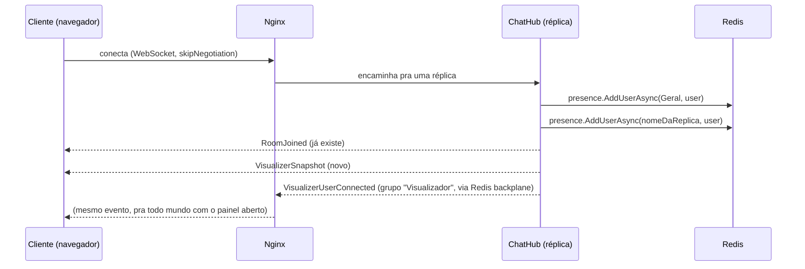

# Visualizador de Arquitetura: Design

## Objetivo

Hoje o web-chat *faz* escalonamento horizontal de verdade (3 réplicas do
backend atrás de um load balancer sem sticky sessions, com Redis como
backplane), mas isso é invisível pra quem usa o app, parece só "mais um
chat". Este recurso expõe essa arquitetura visualmente, num painel lateral
sempre visível ao lado da conversa, mostrando os 3 servidores, o Nginx, o
Redis, quem está conectado em cada servidor, e o fluxo real das mensagens
e conexões acontecendo em tempo real.

É a peça que mais evidencia o diferencial técnico do projeto pra quem for
avaliar o portfolio.

## Escopo

- Visão agregada de **todo mundo conectado** (não só as próprias mensagens
  de quem está olhando).
- Mensagens da Sala Geral: mostram o nome de quem mandou (já é informação
  pública, todo mundo vê na própria sala).
- Mensagens privadas de terceiros: aparecem só como um pulso anônimo entre
  dois servidores, **sem nome de ninguém nem conteúdo**, o objetivo é
  provar que o caminho técnico existe, não expor conversas alheias.
- Painel fixo, sempre visível na tela de chat (não é uma rota separada),
  com um botão pra esconder/mostrar, começando aberto por padrão.

## Fora de escopo

- Contagem/telemetria de infraestrutura além de conexões e mensagens (CPU,
  memória, latência de rede), não é objetivo deste recurso.
- Qualquer forma de reconstruir o conteúdo de uma mensagem privada de
  terceiros a partir do painel.
- Suporte a um número variável de réplicas, a topologia é sempre fixa
  (exatamente 3 servidores), igual ao resto do projeto hoje.

## Arquitetura: fluxo de dados



Todo cliente conectado ao chat já entra automaticamente no grupo
`"Visualizador"` do SignalR, é a mesma conexão WebSocket que já existe
pro chat, nenhuma conexão nova é aberta. Os eventos do visualizador
trafegam pelo mesmo backplane Redis que já faz o `Clients.Group(...)`
funcionar entre réplicas diferentes hoje.

## Backend

### Lista fixa de réplicas

A topologia é sempre 3 servidores fixos, então o `ChatHub` ganha uma
constante:

```csharp
private static readonly string[] AllReplicaNames = ["Servidor A", "Servidor B", "Servidor C"];
```

Essa lista duplica manualmente os nomes que já estão nas variáveis de
ambiente `REPLICA_NAME` do `docker-compose.yml`, mesma limitação que já
existe hoje com a constante `GeralRoom`. Se algum dia esses nomes mudarem
ou uma 4ª réplica for adicionada, os dois lugares precisam ser
atualizados juntos. Aceitável porque a topologia deste projeto é
propositalmente fixa (é um estudo de escalonamento com 3 réplicas, não um
sistema com número variável de instâncias).

### Reaproveitamento da presença existente

`IRoomPresenceService` já é genérico por nome de "sala" (usado hoje só
pra sala `"Geral"`). Cada servidor passa a tratar o **próprio nome** como
mais uma sala:

- `OnConnectedAsync`: além de `AddUserAsync(GeralRoom, userName)`, chama
  `AddUserAsync(_replicaName, userName)`.
- `OnDisconnectedAsync`: chama `RemoveUserAsync(_replicaName, userName)`
  simetricamente.

Nenhuma lógica Redis nova é escrita, reaproveita 100% do serviço
existente (contagem por conexão via HASH, scripts Lua atômicos, TTL de
4h de segurança), já testado sob estresse.

### Eventos novos do SignalR

Todos mandados pro grupo `"Visualizador"` (exceto o snapshot, que vai só
pro `Clients.Caller`):

| Evento | Quando | Payload |
|---|---|---|
| `VisualizerSnapshot` | ao conectar (`Clients.Caller`) | `Dictionary<string, string[]>`: nome do servidor → usuários conectados nele agora, uma entrada por réplica em `AllReplicaNames` |
| `VisualizerUserConnected` | em `OnConnectedAsync`, após validar identidade | `replica: string, userName: string` |
| `VisualizerUserDisconnected` | em `OnDisconnectedAsync` | `replica: string, userName: string` |
| `VisualizerGeralMessage` | em `SendMessage` | `fromReplica: string, userName: string, activeReplicas: string[]`; `activeReplicas` é a lista de réplicas (calculada na hora, consultando a presença de cada uma) que têm pelo menos um usuário conectado, usada pro pulso "em leque" |
| `VisualizerPrivateMessage` | em `SendPrivateMessage` | `fromReplica: string, toReplicas: string[]`; **sem nenhum campo de nome ou conteúdo**. É uma lista (não um único valor) porque a pessoa destinatária pode ter abas abertas em mais de uma réplica ao mesmo tempo (cada aba pode ter caído numa réplica diferente do Nginx); `Clients.User(...)` entrega a mensagem em todas simultaneamente, então o pulso precisa refletir isso. |

O snapshot precisa de uma leitura pura (sem adicionar/remover ninguém),
que a interface `IRoomPresenceService` hoje não expõe, só existe como
método privado dentro de `RedisRoomPresenceService`. Este recurso adiciona
um método novo à interface:

```csharp
Task<IReadOnlyList<string>> GetUsersAsync(string roomName);
```

O snapshot busca, pra cada nome em `AllReplicaNames`, a lista atual
através desse método.

## Frontend

### Estado (`ChatService`)

Dois sinais novos, seguindo o mesmo padrão dos sinais já existentes:

```typescript
readonly replicaUsers = signal<Map<string, string[]>>(new Map());
readonly visualizerPulses = signal<VisualizerPulse[]>([]);
```

```typescript
export interface VisualizerPulse {
  id: string;
  kind: 'connect' | 'disconnect' | 'geral' | 'privada';
  replica?: string;           // connect/disconnect
  fromReplica?: string;       // geral/privada
  toReplicas?: string[];      // geral (leque) ou privada (pode ter mais de uma réplica)
  userName?: string;          // connect/disconnect/geral, nunca em privada
}
```

Cada pulso é removido do array pelo próprio `ChatService`, via
`setTimeout`, ~2 segundos depois de criado, o componente não precisa
gerenciar essa limpeza.

### Componente novo: `VisualizerPanelComponent`

Standalone, em `frontend/src/app/components/visualizer-panel/`. Desenha
o layout validado no protótipo visual: painel com altura total da tela,
ícones inline em SVG (servidor, load balancer, banco de dados, sem nova
dependência), linhas tracejadas sempre visíveis entre os nós, com os
pulsos animando por cima delas. Os avatares reaproveitam o
`AvatarService` já existente, mesma pessoa, mesmo desenho, em qualquer
lugar do app.

### Layout

`.chat-container` ganha uma 3ª coluna à direita, mesma altura da tela.
Um botão no topo (ao lado do de tema) esconde/mostra o painel; começa
aberto por padrão.

## Casos de borda

- **Mesma pessoa com abas em réplicas diferentes**: o avatar dela aparece
  embaixo de cada servidor onde tiver uma aba conectada, reflexo real de
  como o balanceamento funciona, não é tratado como bug.
- **Reconexão automática**: já existe (`withAutomaticReconnect`); como o
  snapshot é reenviado toda vez que `OnConnectedAsync` roda, o painel se
  realinha sozinho.
- **Conexão derrubada sem `OnDisconnectedAsync` limpo**: herda o TTL de 4h
  do Redis já existente pra sala Geral, de graça, por reaproveitar o mesmo
  serviço.
- **Anonimato do privado**: estrutural, o evento `VisualizerPrivateMessage`
  simplesmente não tem campo de nome, não é uma questão de "esconder na
  tela".

## Teste

- **Backend** (`ChatHubTests.cs`): conectar chama `AddUserAsync` também
  pro nome da réplica e dispara `VisualizerUserConnected`; `SendMessage`
  dispara `VisualizerGeralMessage` com `activeReplicas` correto;
  `SendPrivateMessage` dispara `VisualizerPrivateMessage` **sem nenhum
  campo de nome no payload** (asserção explícita); desconectar espelha o
  conectar.
- **Frontend**: `ng build` limpo; verificação ao vivo com múltiplas abas
  em réplicas diferentes (mesmo método usado no projeto inteiro até aqui)
 : avatar aparecendo no servidor certo, pulso disparando em mensagem e
  em entrar/sair, e mensagem privada de terceiro realmente anônima na
  tela.
